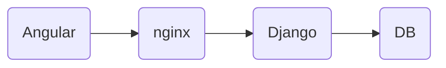

##  Angular Django Docker starter pack

  

This repo is created to speed up the development process and simulate the development environment as close as the production environment.

**stack**
- `Angular` for Front
- `Django` for API
- `Nginx` for reverse proxy
- `Postgres` for DB

  
  
  

##  Get started

1. check out this repo locally
2.  `cd angular-Django-docker-starter`
3.  `docker-compose up` to create images and spin up containers from images

  

####  ports
Angular is running on `localhost:4200`
Django is running on `localhost:8000`

  

####  other docker-compose command

-  `docker-compose up -d` run containers in detached mode
-  `docker-compose up -d repository-name` run specified containers
-  `docker-compose down` to stop running containers
-  `docker exec -it <container-ID> bash`  debug a container

  
  
  
  
  

##  Container Architecture

  

